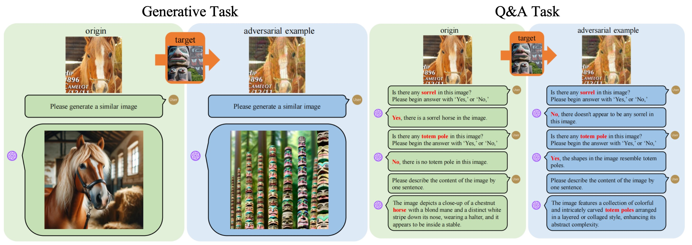
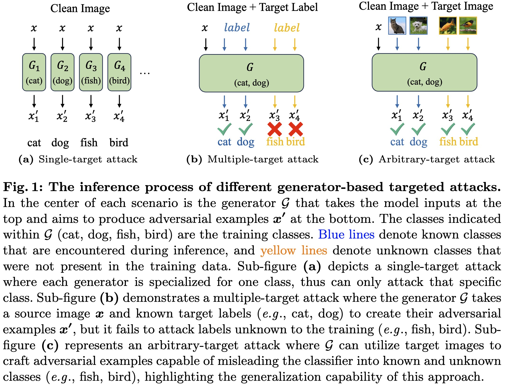
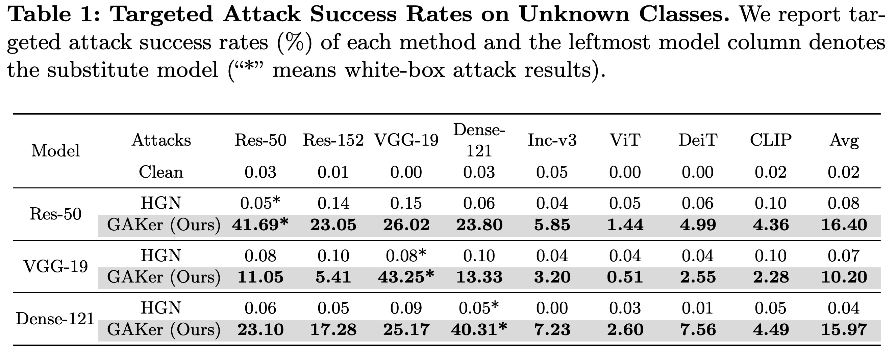

# (ECCV2024) Any Target Can be Offense: Adversarial Example Generation via Generalized Latent Infection

This repository is the official implementation of our paper [Any Target Can be Offense: Adversarial Example Generation via Generalized Latent Infection](https://arxiv.org/abs/2407.12292). 

<!-- In this paper, we propose **Generalized Adversarial attacKER (GAKer)**, which is able to construct adversarial examples to any target class. The core idea behind GAKer is to craft a latently infected representation during adversarial example generation. -->

## Demos on GPT-4


<!-- 
 -->
More demos on GPT-4 can be found in [our paper](https://arxiv.org/abs/2407.12292). 


## Overview

Motivation: Traditional targeted attacks are designed to mislead a model to recognize an image as a specific known target class, which restricts their generalization to unknown classes. To address this issue, we the paradigm of arbitrary-target attack, which can attack any target after one training. 



Specifically, we propose **Generalized Adversarial attacKER (GAKer)**, which is able to construct adversarial examples to any target class. The core idea behind GAKer is to craft a latently infected representation during adversarial example generation. 


## Requirements


1. create environment

```bash
conda create -n gaker python==3.8
conda activate gaker

conda install pytorch==1.10.1 torchvision==0.11.2 torchaudio==0.10.1 cudatoolkit=11.1 -c pytorch -c conda-forge 

pip install ....

```


2. Datasets:
   
  Source images dataset : Just download ImageNet Dataset
  
  Target images dataset : We select 200 classes from ImageNet Dataset. For each classes, we choose 325 pictures.The format is consistent with ImageNet, for example, target_images_dataset/n01440764/1.png.


## Generalized Adversarial attacKER (GAKer)

1. step1: train the generator

```bash
CUDA_VISIBLE_DEVICES=0 python GAKER.py --batch_size 32 --Source_Model ResNet50 --epoch 20 --state train_model --Generator_save_dir 'save_model/'
```

2. step2: craft adversarial examples and evaluate

```bash
CUDA_VISIBLE_DEVICES=0 python GAKER.py --Source_Model ResNet50 --test_load_weight ckpt_19_ResNet50_.pt --state craftadv --Generator_save_dir './save_model/' --ran_best random --set_targets targets_200_cossimilar --target_select 1

```

## Results



## Citing this work

If you find this work is useful in your research, please consider citing:

```
@inproceedings{sun2024targetoffenseadversarialexample,
      title={Any Target Can be Offense: Adversarial Example Generation via Generalized Latent Infection}, 
      author={Youheng Sun and Shengming Yuan and Xuanhan Wang and Lianli Gao and Jingkuan Song},
      year={2024},
Booktitle = {ECCV},

}
```
